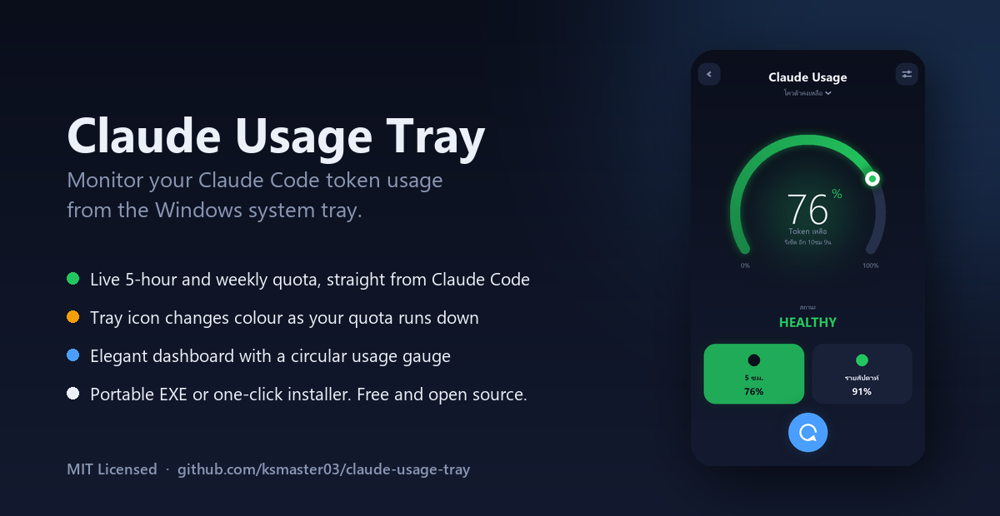
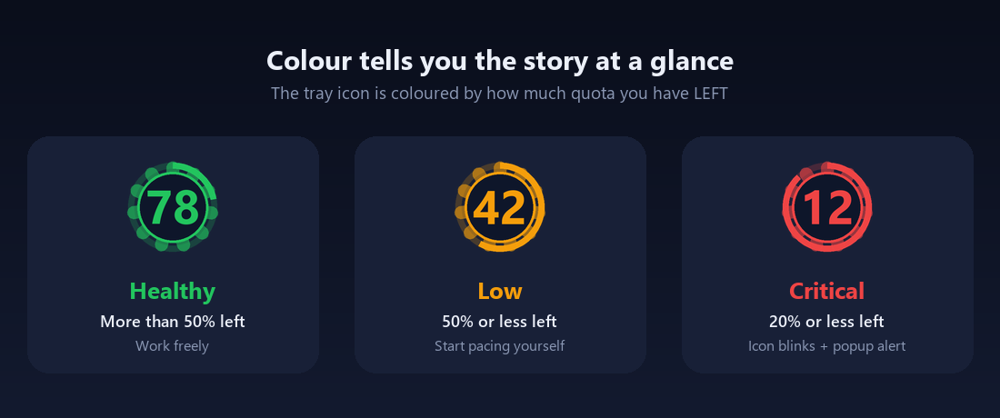
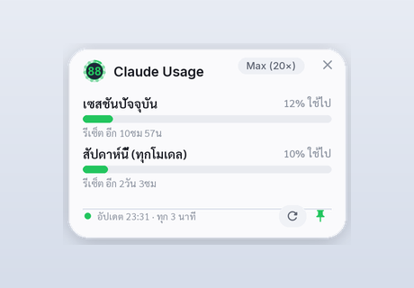
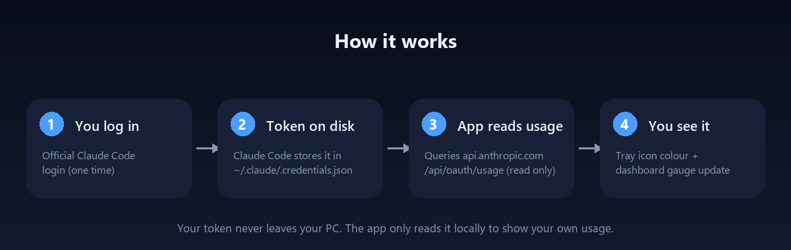

# Claude Usage Tray

[English](README.md) | **ไทย**



โปรแกรมขนาดเล็กสำหรับ Windows ที่คอยมอนิเตอร์การใช้ token ของ **Claude Code** แบบเรียลไทม์
จากถาดระบบ (system tray) ไอคอนจะเปลี่ยนสีเมื่อโควต้าลดลง และคลิกครั้งเดียวก็เปิดหน้า
Dashboard ที่มีเกจวงกลมสวยงามได้ทันที คุณจึงรู้ตลอดว่าเหลือโควต้าของหน้าต่าง 5 ชั่วโมง
และรายสัปดาห์เท่าไหร่ โดยไม่ต้องเปิด terminal

ฟรีและโอเพนซอร์ส (MIT) ใช้ได้กับทุกแพ็กเกจ Claude (Pro, Max, Team) ที่คุณล็อกอินผ่าน
Claude Code ไว้แล้ว

---

## สารบัญ

- [ฟีเจอร์](#ฟีเจอร์)
- [ความหมายของสี](#ความหมายของสี)
- [หลักการทำงาน](#หลักการทำงาน)
- [ความต้องการของระบบ](#ความต้องการของระบบ)
- [การติดตั้ง](#การติดตั้ง)
- [เปิดครั้งแรก — เชื่อมต่อบัญชี Claude](#เปิดครั้งแรก--เชื่อมต่อบัญชี-claude)
- [วิธีใช้งาน](#วิธีใช้งาน)
- [การตั้งค่า](#การตั้งค่า)
- [Build จากซอร์สโค้ด](#build-จากซอร์สโค้ด)
- [แก้ปัญหาที่พบบ่อย](#แก้ปัญหาที่พบบ่อย)
- [ความเป็นส่วนตัวและเงื่อนไขการใช้งาน](#ความเป็นส่วนตัวและเงื่อนไขการใช้งาน)
- [สัญญาอนุญาต](#สัญญาอนุญาต)

---

## ฟีเจอร์

- **เห็นโควต้าสด ๆ ในถาดระบบ** — อ่านลิมิตหน้าต่าง 5 ชั่วโมงและรายสัปดาห์ชุดเดียวกับที่
  คำสั่ง `/usage` ของ Claude Code ใช้ ตัวเลขจึงตรงกันเป๊ะ
- **ไอคอนเปลี่ยนสีตามสถานะ** — เขียว ส้ม หรือแดง ตามโควต้าที่เหลือ ดูปราดเดียวก็รู้สถานะ
  โดยไม่ต้องเปิดอะไรเลย
- **ตัวเลขเปอร์เซ็นต์ใหญ่อ่านง่าย** — แสดง % ที่เหลือขนาดใหญ่กลางไอคอน อ่านออกแม้ย่อเหลือ
  16–32 px
- **หน้า Dashboard กราฟิก** — หน้าต่างธีมเข้มพร้อมเกจวงกลมเรืองแสง การ์ดโควต้าเลือกได้
  เวลานับถอยหลังก่อนรีเซ็ต และปุ่มรีเฟรช
- **วิดเจ็ตลอยหน้าจอ** — แผงธีมสว่างแบบโปร่งใส ปักหมุดค้างไว้บนสุดของจอ แสดงแถบการใช้งาน
  ของเซสชันปัจจุบันและรายสัปดาห์ตลอดเวลา (เลือกเปิดได้)
- **แจ้งเตือนตามเกณฑ์** — เด้ง popup บนหน้าจอและ notification ที่ถาดระบบทันทีที่โควต้า
  ที่เหลือลดต่ำกว่า 50% และต่ำกว่า 20%
- **ทำงานเงียบ ๆ** — ดึงข้อมูลทุก 3 นาที (ปลอดภัยจาก rate limit) อยู่ในถาดระบบ และตั้งให้
  เริ่มพร้อม Windows ได้
- **หลายภาษา** — หน้าจอภาษาอังกฤษ ยูเครน รัสเซีย และไทย สลับได้จากเมนูในถาดระบบ
- **แจกได้ 2 แบบ** — ไฟล์ `.exe` แบบพกพา หรือ installer แบบคลิกเดียว

---

## ความหมายของสี

ไอคอนเปลี่ยนสีตามโควต้าที่ **เหลือ** (ไม่ใช่ที่ใช้ไป)



| สี | โควต้าที่เหลือ | ความหมาย |
|----|----------------|----------|
| เขียว | มากกว่า 50% | สบาย — ใช้งานได้เต็มที่ |
| ส้ม | 50% หรือน้อยกว่า | เริ่มน้อย — เริ่มระวังการใช้งาน |
| แดง | 20% หรือน้อยกว่า | วิกฤต — ไอคอนกะพริบและเด้ง popup เตือน |

เมื่อมีหลายโควต้าทำงานพร้อมกัน (เช่น หน้าต่าง 5 ชั่วโมงและเพดานรายสัปดาห์) ไอคอนจะสะท้อน
**ตัวที่เหลือน้อยที่สุดเสมอ** คุณจึงไม่พลาดลิมิตที่ไม่ได้จับตา ทุกเกณฑ์ปรับได้เอง

---

## วิดเจ็ตลอยหน้าจอ



ทางเลือกธีมสว่างของหน้า Dashboard เปิดจากเมนูถาดระบบ (**วิดเจ็ตลอยหน้าจอ**) เป็นแผงโปร่งใส
ปักหมุดค้างบนสุดเหนือหน้าต่างอื่น แสดงแถบการใช้งานแนวนอนของเซสชันปัจจุบันและลิมิตรายสัปดาห์
พร้อม badge แพ็กเกจและเวลารีเซ็ต ลากย้ายได้ กดหมุดเพื่อสลับ "อยู่บนสุดตลอด" กดปุ่มรีเฟรชเพื่อ
อัปเดตทันที ปรับความโปร่งใสด้วย `widget_opacity` หรือให้เปิดตอนเริ่มโปรแกรมด้วย `widget_on_start`
ใช้ฟอนต์ Sarabun และ Inter กับไอคอน Material Symbols

---

## หลักการทำงาน



1. คุณล็อกอิน Claude ผ่าน **Claude Code** (CLI อย่างเป็นทางการ) หนึ่งครั้ง
2. Claude Code เก็บ access token ไว้ในเครื่องที่ `~/.claude/.credentials.json`
3. Claude Usage Tray อ่าน token นั้นแล้วเรียก
   `https://api.anthropic.com/api/oauth/usage` แบบอ่านอย่างเดียว เพื่อดึง % โควต้าปัจจุบัน
   และเวลารีเซ็ต
4. สีไอคอนในถาดระบบและเกจในหน้า Dashboard อัปเดต

token ไม่เคยออกจากเครื่องคุณ แอปแค่อ่านในเครื่องเพื่อแสดงการใช้งานของคุณเอง และติดต่อกับ
`api.anthropic.com` เท่านั้น

---

## ความต้องการของระบบ

- Windows 10 หรือ Windows 11
- ติดตั้ง **Claude Code** และล็อกอินด้วยแพ็กเกจ Claude (Pro, Max หรือ Team) ไว้แล้ว
  แอปจะอ่านบัญชีที่คุณล็อกอินอยู่
  - ติดตั้ง Claude Code: `npm install -g @anthropic-ai/claude-code`

คุณ **ไม่จำเป็น** ต้องมี Python เพื่อรันไฟล์ `.exe` ที่ปล่อยไว้

---

## การติดตั้ง

เลือกแบบใดแบบหนึ่ง

### แบบที่ 1 — Installer (แนะนำ)

1. ดาวน์โหลด `ClaudeUsageTray-Setup.exe` จากหน้า
   [Releases](https://github.com/ksmaster03/claude-usage-tray/releases)
2. เปิดไฟล์ ตัว wizard ให้เลือก:
   - สร้างไอคอนบนหน้าจอ (Desktop)
   - เริ่มโปรแกรมอัตโนมัติเมื่อเปิดเครื่อง
3. ติดตั้งระดับผู้ใช้ (ไม่ต้องสิทธิ์ผู้ดูแลระบบ) และเปิดใช้งานได้ทันทีหลังติดตั้ง

ถอนการติดตั้งภายหลัง: **Settings > Apps > Claude Usage Tray > Uninstall** หรือใช้ทางลัด
"Uninstall" ใน Start menu

### แบบที่ 2 — พกพา (Portable)

1. ดาวน์โหลด `ClaudeUsageTray.exe` จากหน้า Releases
2. วางไว้ที่ไหนก็ได้แล้วดับเบิลคลิกเพื่อรัน ไม่มีการติดตั้ง

> หมายเหตุ: ไฟล์ยังไม่ได้ code-sign ดังนั้น Windows SmartScreen อาจเตือน "unknown
> publisher" ครั้งแรกที่รัน ให้กด **More info > Run anyway**

---

## เปิดครั้งแรก — เชื่อมต่อบัญชี Claude

แอปอ่านบัญชี Claude ที่ล็อกอินไว้ใน Claude Code บนเครื่องนี้ แต่ละคนที่รันแอปจะเห็นการใช้งาน
ของตัวเอง ไม่มีอะไรต้องแชร์หรือกรอก

ถ้าครั้งแรกยังไม่พบการล็อกอิน จะมีหน้าต่าง **เชื่อมต่อ** ขึ้นมาแนะนำทีละขั้น:

1. ติดตั้ง Claude Code ถ้ายังไม่มี:
   `npm install -g @anthropic-ai/claude-code`
2. กด **เปิด Login ผ่าน Claude Code** (หรือเปิด terminal พิมพ์ `claude` แล้วสั่ง `/login`)
3. ล็อกอินบัญชี Claude ในเบราว์เซอร์
4. กด **ตรวจสอบอีกครั้ง** ไอคอนจะเปลี่ยนเป็นเขียวและเริ่มแสดงการใช้งาน

เปิดหน้านี้ใหม่ได้ทุกเมื่อจากเมนูถาดระบบ: **เชื่อมต่อบัญชี Claude**

---

## วิธีใช้งาน

หาไอคอนในถาดระบบ (มุมขวาล่างของ taskbar กดลูกศร `^` ถ้าถูกซ่อน)

**เปิดหน้า Dashboard** — ดับเบิลคลิกไอคอน หรือคลิกขวาแล้วเลือก **ดูรายละเอียด** หน้า
Dashboard จะแสดง:

- เกจวงกลมพร้อม % ที่เหลือของโควต้าที่เลือก
- การ์ดของแต่ละโควต้า (เช่น "5 ชั่วโมง" และ "รายสัปดาห์") — แตะการ์ดเพื่อให้เกจแสดง
  โควต้านั้น
- เวลานับถอยหลังก่อนรีเซ็ตของแต่ละโควต้า
- ปุ่มรีเฟรชกลม เพื่อดึงตัวเลขล่าสุดทันที

ลากที่ใดก็ได้บนหน้าต่างเพื่อย้าย กด **Esc** หรือลูกศรย้อนกลับเพื่อปิด

**เมนูคลิกขวา:**

| รายการ | ทำอะไร |
|--------|--------|
| รีเฟรชเดี๋ยวนี้ | ดึงข้อมูลการใช้งานล่าสุดทันที |
| ดูรายละเอียด | เปิดหน้า Dashboard |
| วิดเจ็ตลอยหน้าจอ | เปิดวิดเจ็ตธีมสว่างแบบโปร่งใส ปักหมุดได้ |
| เชื่อมต่อบัญชี Claude | เปิดหน้าล็อกอิน / onboarding |
| เกี่ยวกับ | ข้อมูลแอปและลิงก์ไปโปรเจกต์บน GitHub |
| เริ่มพร้อม Windows | เปิด/ปิดการเริ่มอัตโนมัติ |
| แจ้งเตือน (balloon) | เปิด/ปิด notification ตอนข้ามเกณฑ์ |
| Popup เตือนต่ำกว่า 50% / 20% | เปิด/ปิดหน้าต่างเตือนบนหน้าจอ |
| ภาษา (Language) | สลับภาษาของหน้าจอ (English, Українська, Русский, ไทย) |
| ออก | ปิดโปรแกรม |

**การแจ้งเตือน** — เมื่อโควต้าที่เหลือลดลงถึง 50% ครั้งแรก และอีกครั้งที่ 20% แอปจะเด้ง
popup เตือน (และ notification ถ้าเปิดไว้) โดยเตือนครั้งเดียวต่อการข้ามหนึ่งครั้ง ไม่รบกวนซ้ำ

---

## การตั้งค่า

ค่าตั้งต่าง ๆ เก็บที่ `~/.claude-usage-tray.json` (สร้างอัตโนมัติครั้งแรก) แก้ด้วย text editor
ใดก็ได้ แล้วรีสตาร์ตแอป

| คีย์ | ค่าเริ่มต้น | คำอธิบาย |
|------|-----------|----------|
| `poll_seconds` | `180` | วินาทีต่อรอบอัปเดต **อย่าตั้งต่ำกว่า 180** เพราะ endpoint จะ rate-limit ถ้าดึงถี่เกิน |
| `green_above` | `50` | % ที่เหลือ "เกินกว่านี้" ไอคอนเป็นเขียว |
| `orange_at` | `50` | % ที่เหลือ "เท่ากับหรือต่ำกว่านี้" ไอคอนเป็นส้ม |
| `red_at` | `20` | % ที่เหลือ "เท่ากับหรือต่ำกว่านี้" ไอคอนเป็นแดง (และกะพริบ) |
| `notify` | `true` | เด้ง notification ที่ถาดระบบเมื่อข้ามเกณฑ์ |
| `popup_alert` | `true` | เด้ง popup บนหน้าจอเมื่อที่เหลือต่ำกว่า 50% / 20% |
| `blink_when_red` | `true` | กะพริบไอคอนขณะอยู่สถานะแดง |
| `show_percent_text` | `true` | แสดงตัวเลข % ที่เหลือบนไอคอน |
| `watch` | `["five_hour", "seven_day"]` | โควต้าที่ใช้กำหนดสีไอคอน (ตัวที่เหลือน้อยสุดชนะ) |
| `widget_opacity` | `0.94` | ความโปร่งใสของวิดเจ็ตลอยหน้าจอ (0.5–1.0) |
| `widget_on_start` | `false` | เปิดวิดเจ็ตลอยหน้าจออัตโนมัติเมื่อเริ่มโปรแกรม |
| `language` | `"th"` | ภาษาของหน้าจอ: `en`, `uk`, `ru` หรือ `th` (สลับจากเมนูในถาดระบบได้ด้วย) |

---

## Build จากซอร์สโค้ด

ต้องมี Python 3.10+ บน Windows

```bash
git clone https://github.com/ksmaster03/claude-usage-tray.git
cd claude-usage-tray
pip install -r requirements.txt
```

รันโหมด dev:

```bash
python -m claude_usage_tray
```

Build เป็นไฟล์ executable:

```bash
pip install pyinstaller
python build.py
# ผลลัพธ์: dist/ClaudeUsageTray.exe
```

Build ทั้ง executable **และ** installer ในคำสั่งเดียว:

```bat
build_all.bat
```

`build_all.bat` จะรัน PyInstaller แล้วคอมไพล์ `installer.iss` ด้วย
[Inno Setup](https://jrsoftware.org/isdl.php) (ติดตั้งก่อน) ผลลัพธ์:

- `dist/ClaudeUsageTray.exe` — ไฟล์พกพา
- `dist_installer/ClaudeUsageTray-Setup.exe` — installer

สร้างภาพประกอบเอกสารใหม่:

```bash
python scripts/make_docs.py   # เขียนไฟล์ docs/*.png
```

### โครงสร้างโปรเจกต์

```
claude-usage-tray/
  claude_usage_tray/
    api.py         อ่าน token และเรียก usage endpoint
    status.py      แปลง response เป็นสถานะ + สี
    icon.py        วาดไอคอนถาดระบบตามสี
    dashboard.py   เรนเดอร์หน้า Dashboard กราฟิก (Pillow)
    widget.py      เรนเดอร์วิดเจ็ตลอยหน้าจอ ธีมสว่าง (Pillow)
    ui.py          หน้าต่าง tkinter: dashboard, widget, alert, onboarding, about
    tray.py        ลูปถาดระบบ, เมนู, การ poll, การแจ้งเตือน
    config.py      โหลด/บันทึกการตั้งค่า
    autostart.py   สลับเริ่มพร้อม Windows
    i18n.py        คำแปล UI: ฟังก์ชัน t("key") และการสลับภาษา
    locales/       ไฟล์คำแปล (en / uk / ru / th .json)
  app.py           entry point สำหรับ build
  build.py         build ด้วย PyInstaller
  build_all.bat    build exe + installer
  installer.iss    สคริปต์ Inno Setup
  scripts/make_docs.py  ตัวสร้างภาพประกอบเอกสาร
```

---

## แก้ปัญหาที่พบบ่อย

**ไอคอนเป็นสีเทา** — แอปหา/อ่าน token ไม่เจอ เปิด Claude Code แล้วสั่ง `/login` จากนั้นเลือก
**รีเฟรชเดี๋ยวนี้** จากเมนูถาดระบบ

**ขึ้นข้อความ "token expired"** — token ถูก Claude Code หมุนใหม่ เปิด Claude Code (หรือสั่ง
`/login` อีกครั้ง) แล้วแอปจะรับ token ใหม่ให้อัตโนมัติ

**ขึ้นข้อความ "rate limited"** — ดึงข้อมูลถี่เกินไป ตั้ง `poll_seconds` ไว้ที่ 180 ขึ้นไป

**SmartScreen เตือนตอนเปิดครั้งแรก** — ไฟล์ยังไม่ได้ code-sign กด **More info > Run anyway**
หรือจะ build เองจากซอร์สก็ได้

**ข้อความไทยหรือภาษาอื่นแสดงเพี้ยนในหน้า Dashboard** — Dashboard ใช้ฟอนต์ที่มากับ Windows
(Leelawadee UI, Tahoma, Segoe UI) ตรวจว่า Windows มีชุดฟอนต์มาตรฐานครบ

---

## ความเป็นส่วนตัวและเงื่อนไขการใช้งาน

แอปนี้เป็นตัวมอนิเตอร์แบบอ่านอย่างเดียว อ่าน token ที่ Claude Code เก็บไว้ในเครื่องอยู่แล้ว
แล้วใช้ดึงการใช้งาน **ของคุณเอง** จาก Anthropic ไม่เก็บ ไม่ก๊อป ไม่ส่ง token ไปที่อื่น

เงื่อนไขของ Anthropic ระบุว่า OAuth token ของแพ็กเกจผู้บริโภค (Free, Pro, Max) มีไว้ใช้กับ
Claude Code และ Claude.ai เท่านั้น แอปนี้จึง **ไม่** ทำระบบล็อกอินของตัวเอง แต่พึ่งการล็อกอิน
ผ่าน Claude Code อย่างเป็นทางการล้วน ๆ แล้วอ่าน credential ในเครื่องเพื่อแสดงการใช้งานให้คุณดู
โปรดใช้กับบัญชีที่คุณล็อกอินอยู่แล้ว

---

## เครดิต

ได้แรงบันดาลใจจาก [jens-duttke/usage-monitor-for-claude](https://github.com/jens-duttke/usage-monitor-for-claude)
และคอมมูนิตี้เครื่องมือดูการใช้งาน Claude Code
([ccusage](https://ccusage.com), Claude-Code-Usage-Monitor และอื่น ๆ)

ฟอนต์และไอคอน: [Sarabun](https://fonts.google.com/specimen/Sarabun) และ
[Inter](https://fonts.google.com/specimen/Inter) (สัญญาอนุญาต SIL Open Font) และ
[Material Symbols](https://github.com/google/material-design-icons) (Apache 2.0)

## สัญญาอนุญาต

[MIT](LICENSE) ใช้ แก้ไข และเผยแพร่ได้อย่างอิสระ
